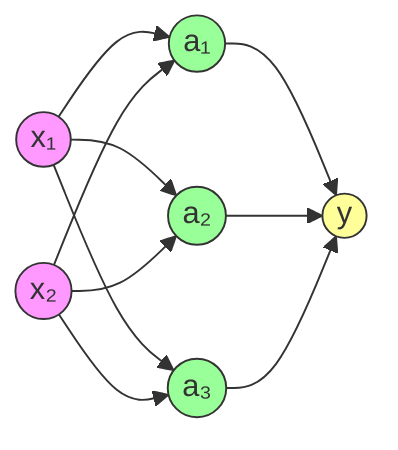

# Tecnológico de Monterrey  
 

**Desarrollo de Aplicaciones Avanzadas de Ciencias Computacionales**  

## Examen de Inteligencia Artificial

## Datos del Estudiante
**Nombre:** _________________________________________________  
**Matrícula:** _________________  
**Fecha:** ___________________  

## Instrucciones
- ⏱️ **Duración:** 30 minutos
- ✏️ **Total preguntas:** 10
- ✅ **Tipo:** Opción múltiple (solo una respuesta correcta por pregunta)
- 📝 **Material permitido:** Ninguno
- 📌 **Valor por pregunta:** 10 puntos

---

### 1. ¿Cuál es la función de activación más adecuada para problemas de clasificación binaria?
- a) ReLU  
- b) Tanh  
- c) Sigmoide

---

### 2. Para prevenir overfitting en un modelo, ¿qué técnica es más efectiva?
a) Aumentar parámetros  
b) Regularización (L1/L2)
d) Eliminar capas ocultas

---

### 3. Al trabajar con imágenes, ¿qué arquitectura es preferible?
a) RNN  
b) CNN
c) SVM  
d) Árboles de decisión

---

### 4. ¿Qué algoritmo ajusta los pesos en redes neuronales?
a) Forward pass  
b) Gradiente descendente  
c) Regla de la cadena 
d) Todos los anteriores

---

### 5. Predecir el precio de una vivienda es un problema de:
a) Clasificación  
b) Regresión 
c) Clustering  
d) Detección de anomalías

---

### 6. En CNNs, ¿qué capa reduce dimensiones espaciales?
a) Convolucional  
b) Pooling 
c) Dropout  
d) BatchNorm

---

### 7. Con datos desbalanceados (95%-5%), ¿qué métrica evitar?
a) Recall  
b) F1-score  
c) Accuracy  
d) AUC-ROC

---

### 8. ¿Cómo se llama reutilizar modelos preentrenados?
a) Backpropagation  
b) Transfer Learning  
c) Data Augmentation  
d) Ensemble Learning

---

### 9. ¿Qué red solucionó el vanishing gradient con conexiones residuales?
a) VGG16  
b) ResNet  
c) AlexNet  
d) Inception

---

### 10. Para encontrar patrones en datos sin etiquetas usamos:
a) Supervisado  
b) No supervisado  
c) Por refuerzo  
d) Semi-supervisado

---

### 11. Ejercicio Práctico: Cálculo de Salida en Red Neuronal
Considere la siguiente red neuronal densa:
- **Capa de entrada:** 2 neuronas (x₁, x₂)
- **Capa oculta:** 3 neuronas (a₁, a₂, a₃) con función de activación ReLU
- **Capa de salida:** 1 neurona (y) con función de activación sigmoide

Pesos capa oculta (W¹): 

|0.5 |-0.2| 
|-|-|
|0.3|0.8|           
|-0.6|1.0|  

Bias capa oculta (b¹): 

| 0.1  | -0.3  | 0.5  |
|---|---|---|

Pesos capa salida (W²): 

| 1.2  | -0.7  | 0.9  |
|---|---|---|

Bias capa salida (b²): 

| -0.4  |
|---|

---
