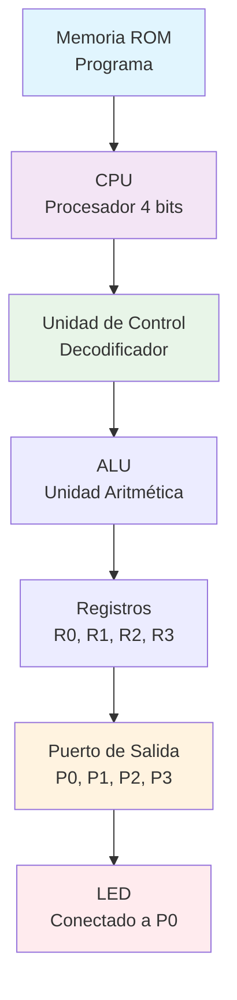
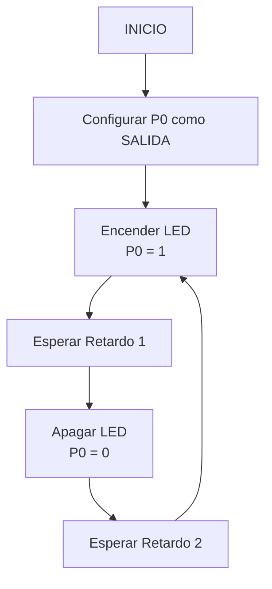

# Actividad 2 - LED Parpadeante (Blinking LED) 💫💡

## 🎯 Objetivo
Programar un **microcontrolador de 4 bits** para crear un efecto de parpadeo en un LED, alternando entre encendido y apagado con intervalos de tiempo.

## ⚙️ ¿Qué vamos a hacer?
Crear un programa en **lenguaje máquina** que:
- **Encienda un LED** durante un periodo de tiempo
- **Lo apague** durante otro periodo de tiempo  
- **Repita este ciclo** infinitamente
- **Utilice retardos** para controlar la velocidad del parpadeo

## 🔧 Diagrama de Arquitectura del Microcontrolador:



## 🛠️ Funcionamiento del Programa:

### 🔄 Diagrama de Flujo:


## 📦 Entregables - Lo que debes entregar:

### 1. 📁 `led_parpadeante.bin` - Archivo binario ejecutable

### 2. 📊 `codigo_parpadeo.xlsx` - Código fuente en Excel

### 3. 🎥 `explicacion_parpadeo.mp4` - Video explicativo

**Temas a cubrir en el video:**
- 📋 **Introducción** al microcontrolador de 4 bits
- 🏗️ **Arquitectura completa** y componentes
- 🔄 **Ciclo Fetch-Decode-Execute**
- 💡 **Control del LED** mediante el puerto P0
- ⏱️ **Implementación de retardos** 
- 🔁 **Bucle infinito** con instrucción JMP
- 🎬 **Demostración práctica** del parpadeo

## 🔌 Conexiones del Circuito:

```
Microcontrolador ────→ LED ────→ Resistencia ────→ Tierra
     (Puerto P0)    (Ánodo)    (220Ω-330Ω)      (GND)
```

## 💡 Conceptos Clave Explicados:

- **🔄 Ciclo de Instrucción**: Cómo la CPU ejecuta cada paso
- **🎛️ Control de Puertos**: Escritura digital de salida
- **⏰ Temporización**: Uso de retardos para control de tiempo
- **💾 Contador de Programa**: Seguimiento de la dirección actual
- **🔗 Bucle Infinito**: Mantener el programa ejecutándose continuamente

## 🚀 Resultado Esperado:
El LED conectado al puerto P0 parpadeará continuamente con un intervalo constante de 500ms, demostrando el control básico de E/S y temporización con un microcontrolador de 4 bits! ✨
