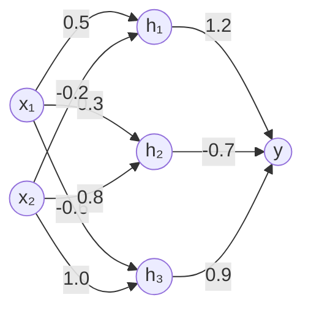

# Tecnológico de Monterrey  
 

**Desarrollo de Aplicaciones Avanzadas de Ciencias Computacionales**  

## Examen de Inteligencia Artificial

## Datos del Estudiante
**Nombre:** _________________________________________________  
**Matrícula:** _________________  
**Fecha:** ___________________  

## Instrucciones
- ⏱️ **Duración:** 30 minutos
- ✏️ **Total preguntas:** 10
- ✅ **Tipo:** Opción múltiple (solo una respuesta correcta por pregunta)
- 📝 **Material permitido:** Ninguno
- 📌 **Valor por pregunta:** 10 puntos

---

## Ejercicio Práctico

**Arquitectura de la red:**

```mermaid
graph LR
    x1((x₁)) -- 0.5 --> h1((h₁))
    x1 -- 0.3 --> h2((h₂))
    x1 -- -0.6 --> h3((h₃))
    x2((x₂)) -- -0.2 --> h1
    x2 -- 0.8 --> h2
    x2 -- 1.0 --> h3
    h1 -- 1.2 --> y((y))
    h2 -- -0.7 --> y
    h3 -- 0.9 --> y
```

**Datos:**
- Entrada: x = [0.7, -0.3]
- Bias capa oculta: [0.1, -0.3, 0.5]
- Bias salida: -0.4
[... resto del ejercicio ...]
